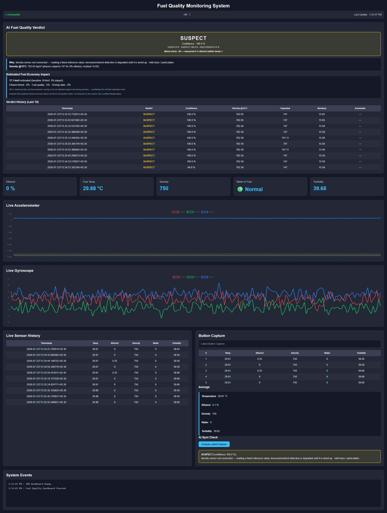

# Fuel Quality Monitoring System

A modular fuel quality monitoring and vehicle telemetry framework built on the **Arduino UNO Q**, leveraging the dual-processor architecture of the Qualcomm Dragonwing QRB2210 MPU (Debian Linux) and the STM32U585 MCU (Zephyr/Arduino).

The project demonstrates a production-style architecture where the MCU performs real-time sensor acquisition while the Linux MPU handles data logging, visualization, analytics, and external communication through the Arduino Router/Bridge RPC framework.

---

# Features

## Fuel Quality Monitoring

- Fuel Temperature
- Ethanol Percentage
- Fuel Density
- Water-In-Fuel (WIF)
- Turbidity

## Vehicle Telemetry

- BMI323 6-DoF IMU
- 100 Hz Accelerometer Sampling
- 100 Hz Gyroscope Sampling
- Live IMU Dashboard
- Circular 30-minute IMU Buffer
- Background IMU Logging

## System Monitoring

- Heartbeat Monitoring
- Missed Heartbeat Detection
- Background Health Monitoring
- JSON Persistent Logging

## User Interface

- Responsive Web Dashboard
- Live Sensor Cards
- Live Accelerometer Graph
- Live Gyroscope Graph
- Historical Sensor Table
- Button Capture Panel
- Mobile Friendly

## Dashboard



---

# System Architecture

```
                    +-----------------------------------+
                    |         Mobile Browser            |
                    |     Live Dashboard (Chart.js)     |
                    +-----------------+-----------------+
                                      |
                                      |
                                 REST APIs
                               WebSocket (IMU)
                                      |
                                      |
                    +-----------------v-----------------+
                    |        Debian Linux (MPU)          |
                    |------------------------------------|
                    | main.py                            |
                    |                                    |
                    | HbManager                          |
                    | SensorManager                      |
                    | ImuManager                         |
                    | AiManager (fuel quality MLP +      |
                    |            drift detection)        |
                    | WebUI                              |
                    | JSON Logger                        |
                    +-----------------+------------------+
                                      |
                        Arduino Router / Bridge RPC
                           MessagePack over UART
                                      |
                    +-----------------v-----------------+
                    |         STM32U585 (MCU)           |
                    |-----------------------------------|
                    | Sensor Acquisition                |
                    | BMI323 IMU                        |
                    | Button Monitoring                 |
                    | Bridge.provide_safe() APIs        |
                    +-----------------------------------+
```

---

# Software Architecture

```
main.py

│

├── HbManager

├── SensorManager

├── ImuManager

├── AiManager

├── WebUI

└── Arduino Bridge
```

Each manager is responsible for its own acquisition, buffering, logging and REST APIs.

---

# Repository Structure

```
.
├── python
│   ├── main.py              app entry: managers + REST APIs
│   ├── hbManager.py         heartbeat monitor
│   ├── sensorManager.py     sensor polling + button capture
│   ├── imuManager.py        BMI323 IMU buffering + streaming
│   ├── aiManager.py         AI worker thread + drift detection
│   ├── fuelQualityModel.py  numpy MLP inference + explanations
│   ├── features.py          shared feature engineering (train==serve)
│   ├── model_weights.json   trained model (6-16-16-3, 435 params)
│   ├── fuel_simulator.py    physics data generator (training)
│   ├── train_model.py       training + JSON export (dev machine)
│   ├── metrics.txt          accuracy + confusion matrix
│   ├── test_ai.py           AI test suite (numpy only)
│   └── local_demo.py        full-stack demo without the board
│
├── assets
│   ├── index.html           web dashboard
│   ├── app.js
│   └── style.css
│
├── sketch
│   ├── sketch.ino
│   └── sketch.yaml
│
├── AI_PLAN.md               AI layer plan & status
├── INTEGRATION.md           AI integration notes
│
├── sensor_history.json
├── sensor_history_button.json
├── hb_history.json
├── imu_history.json
│
├── app.yaml
└── README.md
```

---

# Managers

## HbManager

Responsibilities

- Heartbeat polling
- Heartbeat monitoring
- Missed heartbeat detection
- JSON logging
- Rolling heartbeat history

Output

```
hb_history.json
```

---

## SensorManager

Responsibilities

- Polls all fuel sensors every 10 seconds
- Stores latest readings
- Rolling sensor history
- Button-triggered sensor capture
- Calculates average of five samples
- Persistent JSON logging

Outputs

```
sensor_history.json

sensor_history_button.json
```

---

## ImuManager

Responsibilities

- Receives live BMI323 data over Bridge RPC
- Stores samples in a circular RAM buffer
- Maintains last 30 minutes of data
- Periodically flushes to JSON
- Live WebSocket streaming
- Statistics generation
- Historical retrieval

Output

```
imu_history.json
```

---

## AiManager (AI Layer)

Responsibilities

- Scores every continuous reading with a 435-parameter MLP
  (GOOD / SUSPECT / ADULTERATED) in <1 ms, numpy only
- Physics feature: density temperature-corrected to 15 °C compared
  against the density expected for the measured ethanol % — the
  residual exposes kerosene/solvent dilution
- Refuel-drift anomaly detection (rolling z-score, 30-reading window)
- Plain-language explanations for the dashboard / app UI
- On-demand scoring of button captures

Output

```
ai_history.json
```

Model: trained on a physics-grounded simulator
(`fuel_simulator.py`), 94.2% test accuracy (`metrics.txt`).
Retraining on real calibration data takes seconds:
`python3 train_model.py` regenerates `model_weights.json`.

---

# Bridge RPC APIs

## MCU → Linux

| RPC Method | Description |
|------------|-------------|
| record_sensor_values | Trigger button capture |
| record_imu_values | Send IMU sample |

---

## Linux → MCU

| RPC Method | Description |
|------------|-------------|
| getHbState | Heartbeat |
| getFuelTemp | Fuel Temperature |
| getethanolPercentage | Ethanol Percentage |
| getwif | Water In Fuel |
| getturbidity | Turbidity |
| getdensity | Fuel Density |

---

# REST APIs

| Endpoint | Description |
|----------|-------------|
| /api/sensors | Last 10 fuel sensor readings |
| /api/button_capture | Latest button capture |
| /api/imu_capture | Latest IMU samples |
| /api/imu_history | Last 30 minutes of IMU data |
| /api/imu_statistics | IMU statistics |
| /api/heartbeat | Heartbeat status |
| /api/ai/current | Latest AI verdict (status card) |
| /api/ai/verdicts | Last 10 AI verdicts |
| /api/ai/capture_verdict | AI score of the latest button capture |

---

# Web Dashboard

The dashboard is served directly from the Arduino UNO Q and includes:

- AI fuel quality verdict card with confidence and explanations
- AI verdict history with density-physics breakdown
- Drift / refuel anomaly alerts
- AI spot check of button captures
- Live connection status
- Heartbeat monitor
- Fuel quality cards
- Live accelerometer chart
- Live gyroscope chart
- Live sensor history
- Button capture history
- Averaged sensor values
- Event log

The dashboard is responsive and can be accessed from desktop and mobile devices connected to the same network.

---

# Current Status

## Implemented

- Arduino Router / Bridge RPC
- Modular manager architecture
- Heartbeat monitoring
- Fuel sensor acquisition
- BMI323 integration
- Circular IMU buffer
- AI fuel quality classification (94.2% test accuracy)
- Refuel-drift anomaly detection
- Offline AI test suite + board-free full-stack demo
- JSON persistence
- Web Dashboard
- Chart.js visualization
- Mobile dashboard
- REST APIs
- Background workers
- Thread-safe acquisition

---

# Testing

Offline AI test suite (needs only numpy):

```
cd python
python3 test_ai.py
```

Full-stack demo without the UNO Q (real SensorManager + AiManager
against a mock bridge, real dashboard at http://localhost:8000):

```
cd python
python3 local_demo.py
```

---

# Planned Features

- MQTT publishing
- BLE companion application
- OTA firmware updates
- Driver behavior scoring from IMU
- Crash detection
- Vehicle tilt detection
- Harsh braking detection
- Road roughness estimation
- Sensor calibration
- Data export (CSV/JSON)
- Historical playback
- Cloud synchronization

---

# Technologies

- Arduino UNO Q
- Qualcomm Dragonwing QRB2210
- STM32U585
- Debian Linux
- Arduino Router / Bridge
- MessagePack RPC
- Python 3
- HTML5
- CSS3
- JavaScript
- Chart.js
- JSON
- Multithreading

---

# License

MIT License